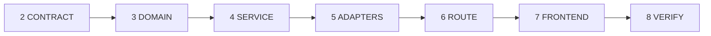

# AI Agent Code Generation Workflow

> **Purpose:** A repeatable, industry-aligned workflow for any AI agent (Cursor, Copilot,
> Cloud Agent, Claude, etc.) generating code in the Travel Planner monorepo.
>
> **Authority:** This workflow implements [`plans/superpower/PLAN.md`](../plans/superpower/PLAN.md) §12.
> On architecture, data-flow, or product-behavior conflict, **PLAN.md wins**.
> For exact UI tokens, responsive presentation, component states, and accessibility,
> [`UI-UX-DESIGN-SYSTEM.md`](UI-UX-DESIGN-SYSTEM.md) wins over illustrative PLAN examples.

---

## 0. Session bootstrap (always)

Run once at the start of every coding session.

```bash
npm run prereq                      # stop if this fails
npm run task:context -- NN          # the pack: gate, DoD, PLAN line ranges, open findings
git checkout -b agent/task-NN-<slug> dev
```

**Start with `task:context`, not with the PLAN.** The 2026-07-29 review's central finding about this
project was not that the AI writes bad code — it was that every task pays to rediscover the same
context. `plans/superpower/PLAN.md` is 3,700 lines; the pack is about four kilobytes and answers the
questions that actually block a start:

- which dependencies are `done`, and which are not (computed, not quoted from a table)
- the objective, scope, "do not" list and Definition of Done, verbatim from the brief
- every `§` reference in Required reading resolved to a **line range**
- the next free migration number, derived from the filenames
- which ports exist, which have no implementation, which error codes are untranslated
- the `F-NN` findings already recorded against this task
- the previous task's handoff

Then read three or four real files. `docs/generated/CODE-MAP.json` says which ones.

### Required reading by task type

The pack resolves these to line ranges for the task at hand — this table is the fallback.

| Task | Read before writing code |
|---|---|
| Any | `AGENTS.md`, this file §1–§7 |
| Backend endpoint | PLAN §4.0.1, §4.0.2, §6.1, §13.1 |
| Frontend screen | `UI-UX-DESIGN-SYSTEM.md` + PLAN §4.2.6, §4.2.9, §4.2.10, §4.2.11, §13.2 |
| AI / agent feature | PLAN §4.1, §5, §4.0.7 + `ai/` package layout |
| DB migration | PLAN §4.0.2-H, §4.0.2-E2, §8 |
| Infra / Docker | PLAN §4.0.0, §15 |

---

## 1. Classify the task

Pick **one primary workflow** — do not mix unrelated work in one PR.

| Type | ID | Examples | Workflow variant |
|---|---|---|---|
| **Foundation** | `F` | Docker, CI, prereq scripts | §3-F only |
| **New feature (C6+)** | `NF` | Post-v1 capability | §3 + [`ADDING-A-FEATURE.md`](ADDING-A-FEATURE.md) |
| **Backend feature** | `BE` | New endpoint, service, migration | §3 full, skip §3.7 |
| **Frontend feature** | `FE` | New screen, hook, form | §3.2 → §3.7 (skip §3.3–3.6 if no API change) |
| **Full-stack feature** | `FS` | C1–C5 vertical slice | §3 full |
| **AI / agent** | `AI` | Agent, prompt, tool, guardrails | §3 + §4 AI addendum |
| **Docs / plan only** | `D` | PLAN, ADR, backlog | No code; skip §3 |

**Output of classification (state explicitly in your plan):**
```
Task type: FS
Feature: C2 Research
Story: S4-4 Research API
Layers touched: OpenAPI, domain, application, infrastructure (stub), api, features/research
```

---

## 2. Pre-generation checklist (Definition of Ready)

Do **not** write code until all apply:

- [ ] Task maps to a story in [`plans/BACKLOG.md`](../plans/BACKLOG.md) or user gave explicit scope
- [ ] Feature ID known (C1–C5 or Phase 0)
- [ ] OpenAPI paths identified (or spike complete for new resources)
- [ ] Port interfaces named (`*Port.java`) if external I/O involved
- [ ] Error codes listed (`snake_case`) if new failure modes
- [ ] i18n namespace identified (`research.json`, etc.) for frontend work
- [ ] Stub vs live adapter decided — **default: stub** (§4.0.7)

---

## 3. Generation pipeline (strict order)



**Rule:** Never skip steps. Never implement step 6 before step 4.

---

### Step 2 — CONTRACT (API-first)

**Goal:** OpenAPI is the single source of truth.

| Action | Output |
|---|---|
| Add/update paths in `apps/backend/src/.../api/openapi/openapi.yaml` | `/api/v1/` kebab-case paths |
| Define request/response schemas | Match domain concepts, not JPA entities |
| Register error codes | `snake_case` in spec + `DomainException` codes |
| Run `npm run codegen` | `apps/frontend/src/generated/api/` updated |
| Verify CI drift check would pass | No hand-written TS API types |

**Gate:** Frontend and backend both compile against the same contract.

```yaml
# ✅ path pattern — list uses GET (mutations use POST action paths)
/api/v1/trips/{tripId}/ranked-recommendations:
  get: ...
```

---

### Step 3 — DOMAIN (pure Java)

**Goal:** Business vocabulary with zero framework imports.

| Action | Location |
|---|---|
| Value objects | `domain/valueobject/` — `Money`, `DateRange`, … |
| Aggregates / models | `domain/model/` |
| Port interfaces | `domain/port/` — `*Port.java` |
| Pure algorithms | `domain/algorithm/` — only when DSA needed (§4.0.3) |
| Domain exceptions | `domain/exception/` — extend `DomainException` |

**Rules:**
- No `import org.springframework.*`, `jakarta.persistence.*`, LangChain4j
- Invariants in constructors
- ≤3 params; bundle into `*Query` / `*Command` records

**Gate:** `domain/` compiles with **zero** framework dependencies.

---

### Step 4 — SERVICE (business logic)

**Goal:** All rules and orchestration live here.

| Action | Location |
|---|---|
| Use-case class | `application/<feature>/*Service.java` |
| Unit tests | `*ServiceTest.java` — mock ports, no Spring context |
| Transactions | `@Transactional(rollbackFor = Exception.class)` on writes |
| Read queries | `@Transactional(readOnly = true)` |
| Deadlock safety | `@Version`, consistent lock order, `@Retryable` (§4.0.2-E2) |

**Transaction rules (industry standard ACID):**

```java
// ✅ Pattern: LLM outside tx, persist inside short tx
public Result doWork(Command cmd, UserContext user) {
    var validated = externalStep(cmd);              // LLM / HTTP — NO @Transactional
    return persistResult(validated, user);          // short @Transactional method
}

@Transactional(rollbackFor = Exception.class)
Result persistResult(Validated v, UserContext user) { ... }
```

**Visibility:** `public` = use-case entry only. Reusable steps → `private` methods (§4.0.2-B4).

**Gate:** Service unit tests pass with mocked ports.

---

### Step 5 — ADAPTERS (infrastructure + AI)

**Goal:** Implement ports; no business rules in adapters.

| Adapter type | Location | Notes |
|---|---|---|
| JPA / Flyway | `infrastructure/persistence/` | Entities never leave this package |
| External HTTP | `infrastructure/<vendor>/` | `Stub*Adapter` first (§4.0.7) |
| LangChain4j | `ai/langchain4j/` **only** | Implements `LlmPort` etc. |
| Agents / tools | `ai/agent/`, `ai/tool/` | Bounded loops, token budgets |
| Prompts | `ai/prompt/` | Versioned templates |

**Gate:** Integration test for I/O adapters where feasible (Testcontainers).

---

### Step 6 — ROUTE (thin controller)

**Goal:** HTTP mapping only — ≤10 lines per endpoint.

```java
@GetMapping("/api/v1/trips/{tripId}/ranked-recommendations")
public RankedRecommendationsResponse list(@PathVariable UUID tripId,
        @AuthenticationPrincipal UserContext user) {
    return researchMapper.toResponse(
        researchService.listRecommendations(tripId, user));
}
```

**Inject:** services only — never repositories, `LlmClient`, or supplier clients.

**Gate:** Controller slice test — verify routing, mock service.

---

### Step 7 — FRONTEND (feature module)

**Goal:** Thin page → feature → hook → api → generated client.

```
app/.../page.tsx          →  import from features/<name>/index.ts only
features/<name>/
  components/*-panel.tsx  →  'use client', Ant Design, loading/error/empty
  hooks/use-*.ts          →  React Query, calls lib/api/
  schemas/*.schema.ts     →  zod
  types.ts                →  *Props, *FormValues
  index.ts                →  public exports only
lib/api/<resource>-api.ts →  zod validate, 1 param per function
```

**Mandatory patterns:**
- Follow `UI-UX-DESIGN-SYSTEM.md` for visual tokens, responsive behavior, and interaction states
- Ant Design `Form` + `onValuesChange` — debounced save in parent hook
- `useTranslations('namespace')` — no hardcoded UI strings
- Tailwind from design tokens — no arbitrary hex values
- Line length ≤120 (ESLint `max-len`)

**Gate:** Component tests or manual check of loading / error / empty states.

---

### Step 8 — VERIFY (before presenting diff)

Three stages, cheapest first. **The gates are identical at every stage — only the timing differs.**
Nothing is skipped or weakened; `verify:full` still runs exactly what CI runs.

```bash
npm run verify:fast              # every edit. Scoped by `git diff`: a backend-only change
                                 # does not start Node. Seconds.
npm run verify:task -- NN         # before claiming the task is done. Adds coverage thresholds,
                                 # ArchUnit, format check, contract and CODE-MAP drift.
npm run verify:full              # what CI runs, Testcontainers and production build included.
                                 # Needs Docker.
```

Why this ladder exists: the only command previously documented was the full one, so an agent fixing a
one-line style violation paid for Testcontainers, a Next.js production build and whole-repository
coverage to find out. That cost is not paid once — it is paid on every iteration of the edit loop,
which is where nearly all of an agent's time goes.

A **skipped** step is never reported as a pass. `verify:task` and `verify:full` fail outright if any
step could not run — those are the stages whose output gets quoted as evidence.

```bash
npm run task:report -- NN         # runs the real gates and writes artifacts/task-NN-evidence.md
```

---

## 4. AI / agent addendum (type `AI` tasks)

Extra steps when touching `ai/`:

| Step | Action |
|---|---|
| A1 | Define structured output type in domain — never persist free text |
| A2 | Add JSON schema / `Guardrails` validation before persist |
| A3 | Add golden-file test fixture in `src/test/resources/ai/` |
| A4 | Log tokens + latency to `ai_call_log` — not full prompts in prod |
| A5 | Agent loop: max tool calls + token budget — bounded in config |
| A6 | Never auto-book — agent proposes only (§7) |
| A7 | Prompt change → eval harness must pass in CI |

**LangChain4j import rule:** only files under `ai/langchain4j/` may import LangChain4j classes.

---

## 5. Code quality gates (industry + project standards)

Every generated file must satisfy:

| Gate | Standard | Enforcement |
|---|---|---|
| Line length | ≤120 chars (soft 100) | Checkstyle / ESLint |
| Method length | ≤40 lines | Code review |
| Parameters | ≤3 per function | Code review |
| Visibility | Minimal `public` surface | §4.0.2-B4 |
| Transactions | Rollback on failure, commit on success | `@Transactional(rollbackFor = Exception.class)` |
| Deadlock | Lock order, `@Version`, retry | §4.0.2-E2 |
| Money | `BigDecimal` + currency — never `double` | Domain + DB `numeric` |
| Errors | `{ code, message, details }` snake_case codes | §6.1 |
| Auth scope | Filter by `user_id` from `UserContext` | Every query |
| Secrets | Env only — never in source | CI secret scan |

---

## 6. Forbidden patterns (auto-fail)

If you generate any of these, **fix before finishing**:

| ❌ Forbidden | ✅ Instead |
|---|---|
| Business `if` in controller | Move to `*Service` |
| `llmClient` injected in controller | Service → port → adapter |
| JPA entity in API response | MapStruct → response DTO |
| LangChain4j import in `application/` | `ai/langchain4j/` adapter |
| Hand-written `interface Trip` in frontend | `@/generated/api` |
| `fetch()` in `app/**/page.tsx` | Feature hook → `lib/api/` |
| `useState` per form field | Ant Design `Form` + `onValuesChange` |
| Cross-feature import | Extract to `components/ui/` |
| LLM call inside `@Transactional` | Call LLM first, persist in separate tx |
| `catch (Exception e) {}` swallowing | Typed exceptions → rollback |
| Public helper on service | `private` method |
| Line >120 characters | Break line or extract variable |
| CSS Module new file | Tailwind utilities |
| Hardcoded UI string | `t('key')` + locale file |
| `PATCH` endpoint | `PUT` or action `POST` |

---

## 7. Self-check matrix (copy before completing task)

### Backend

- [ ] Controller ≤10 lines, no business logic
- [ ] Service has unit tests with mocked ports
- [ ] `@Transactional(rollbackFor = Exception.class)` on writes
- [ ] No LLM/HTTP inside transaction
- [ ] Domain has no framework imports
- [ ] DTO ≠ domain ≠ JPA entity
- [ ] Error codes in OpenAPI
- [ ] Line length ≤120, method ≤40 lines, params ≤3
- [ ] Reusable logic is `private` helper

### Frontend

- [ ] UI follows `UI-UX-DESIGN-SYSTEM.md` tokens, states, responsive, and accessibility rules
- [ ] Page ≤20 lines, no data fetching
- [ ] Feature code in `features/<name>/`
- [ ] Hook → `lib/api/` → generated types
- [ ] Form uses `onValuesChange`
- [ ] Loading / error / empty states
- [ ] i18n keys in snake_case JSON
- [ ] Public exports only via `index.ts`
- [ ] Line length ≤120

### Full-stack

- [ ] OpenAPI updated + codegen run
- [ ] End-to-end happy path describable in one sentence
- [ ] §12.3 PR checklist in PLAN.md — all items pass

---

## 8. Git & PR protocol

```bash
git checkout -b cursor/<descriptive-name>-5b6b
# ... implement ...
git add <specific files>
git commit -m "feat(c2): add ranked-recommendations endpoint"
git push -u origin cursor/<descriptive-name>-5b6b
```

| Rule | Detail |
|---|---|
| Commits | Conventional commits: `feat`, `fix`, `chore`, `docs` |
| Scope | One feature per PR — minimal diff |
| PR body | Copy §12.3 checklist from PLAN.md; tick all boxes |
| Draft PR | Default for agent-generated work until CI green |

---

## 9. Workflow variants

### F — Foundation only (Phase 0a)

```
prereq → docker → CI → health endpoints → PR
```
Skip §3.3–3.7 unless scaffolding apps.

### FE — Frontend-only (no API change)

```
§2 (skip if no contract change) → §3.7 → §8
```
Still read existing OpenAPI / generated types.

### BE — Backend-only

```
§3.2 → §3.3 → §3.4 → §3.5 → §3.6 → §8
```

### D — Docs only

```
Edit plans/ or docs/ → no code → commit → PR
```

---

## 10. Decision tree — where does this file go?

```
Is it HTTP routing?
  yes → api/controller/ (thin) + api/dto/ + api/mapper/
  no ↓
Is it a business rule or orchestration?
  yes → application/<feature>/*Service.java
  no ↓
Is it a core concept or invariant?
  yes → domain/model/ or domain/valueobject/
  no ↓
Is it what the domain needs from outside?
  yes → domain/port/ (interface) → infrastructure/ or ai/ (impl)
  no ↓
Is it LLM / prompt / agent?
  yes → ai/ (langchain4j/ for vendor imports only)
  no ↓
Is it DB schema or entity?
  yes → infrastructure/persistence/ + Flyway migration
  no ↓
Is it a React screen?
  yes → features/<feature>/ (app/ for page shell only)
  no ↓
Is it API client or shared util?
  yes → lib/api/ or lib/utils/
```

---

## 11. Agent output template

When presenting completed work, use this structure:

```markdown
## Summary
[One sentence: what was built]

## Task classification
- Type: FS | Feature: C2 | Story: S4-4

## Changes
- `path/to/file` — [what changed]

## Workflow steps completed
- [x] Contract (OpenAPI + codegen)
- [x] Domain
- [x] Service + tests
- [x] Adapters
- [x] Route
- [x] Frontend
- [x] Verify

## Self-check
- [x] §7 backend matrix
- [x] §7 frontend matrix

## How to test
[commands or steps]
```

---

## 12. References

| Document | Purpose |
|---|---|
| [`docs/UI-UX-DESIGN-SYSTEM.md`](UI-UX-DESIGN-SYSTEM.md) | Unified web and PWA design contract |
| [`docs/PLAN-COMPATIBILITY.md`](PLAN-COMPATIBILITY.md) | Post-merge plan compatibility review |
| [`docs/ADDING-A-FEATURE.md`](ADDING-A-FEATURE.md) | Adding C6+ features |
| [`AGENTS.md`](../AGENTS.md) | Entry point — quick rules |
| [`plans/superpower/PLAN.md`](../plans/superpower/PLAN.md) | Full architecture & rules |
| [`plans/BACKLOG.md`](../plans/BACKLOG.md) | Sprint stories |
| [`docs/adr/`](../docs/adr/) | Locked decisions |
| PLAN §12.3 | PR checklist |
| PLAN §13 | Quick reference (B1–B35, F1–F33, X1–X14) |
| PLAN §15 | CI/CD pipeline |

---

## 13. Version

| Field | Value |
|---|---|
| Workflow version | 1.0 |
| Aligned to PLAN | `plans/superpower/PLAN.md` (post tech-lead + coding-rules pass) |
| Last updated | 2026-07-25 |

---

## 8. Working in parallel — one writer, two readers

From the review's §6.G. The constraint is not about trust, it is about diffs: two agents writing to
one capability produce a change nobody can review, and a conflict nobody can attribute.

| Role | Access | Responsibility |
|---|---|---|
| **Context / planner** | read-only | Produce the `task:context` pack, the file list, the risk list, and the test plan. Does not write code. |
| **Implementer** | write, one capability | Implement exactly one task or capability gate. Does not widen scope; a discovered defect becomes a finding, not an extra commit. |
| **Reviewer / test** | read-only, or test-only fixes | Read the diff, run the gates, file findings. **Does not refactor on the way past** — a reviewer's tidy-up is a change with no reviewer. |

**Two writing agents must never share a capability branch.** Parallelism happens only where the
dependency graph in `tasks/EXECUTION-BASELINE.md` §4 says two capabilities are independent, and each
gets its own `agent/task-NN-*` branch off `dev`.

## 9. Keeping context cheap

Four rules, all from the review's §6.H. Each one is about the same thing: an agent pays to read the
repository on every task, so what the repository says has to be worth reading.

1. **Comments carry invariants and traps, not narrative.** "Why this cannot be a timestamp" belongs in
   the code; the full derivation belongs in an ADR the comment links to. A 300-line file that
   re-explains a rule three other files also explain is a cost paid on every read, forever.
2. **Required reading points at sections, not documents.** `task:context` resolves `§4.0.2` to a line
   range; a brief that says "read the PLAN" is asking a model to read 3,700 lines, and the cheapest
   correct behaviour for a model that cannot find the anchor is to do exactly that.
3. **One or two canonical reference files per layer.** New work copies a named example rather than
   inferring the convention from a survey. `RefreshTokenService` for a write path with revocation,
   `LlmClientRouter` for cross-cutting instrumentation, `chat-state.ts` for a reducer.
4. **Stale documentation is a build failure.** `npm run docs:stale` runs in CI. A document asserting
   that `apps/backend` and `apps/frontend` do not exist is worse than an absent document — it is a
   wrong answer delivered with authority, and it costs a whole task cycle before anyone notices. The
   check cannot tell a quotation from a claim, so this paragraph deliberately describes the pattern
   instead of reproducing it; erring that way keeps false negatives at zero, which matters more.
