# Travel Planner — Architecture Diagrams

> Visual reference for system architecture, flows, and activity.  
> Source of truth: [`plans/superpower/PLAN.md`](../plans/superpower/PLAN.md), [`plans/USE-CASES.md`](../plans/USE-CASES.md).

---

## Logic & flow review

### Core thesis (consistent across docs)

| Principle | How it is enforced |
|---|---|
| **Chat-first UX** | Planner home and per-trip chat are the primary interface; stepper/forms are synced mirrors of chat-driven state |
| **Knowledge-based AI** | Retrieve from TKB → Reason with LLM → Grounded output with `source_refs[]` — never invent facts |
| **Status-gated progression** | `trip.status` drives allowed tools, UI steps, and API gates |
| **Human-confirmed booking** | LLM proposes quotes; user explicitly confirms in C4 UI — never auto-books |
| **Async long work** | Research agent (≤90s) runs as background job; HTTP returns `202` + `job_id` |

### Trip status state machine (logic gates)

The status machine is the **central coordination mechanism**. Every feature (C1–C5) reads and writes through it:

```
DRAFT ──────────────────────────────────────────────┐
  │                                                  │
  ├─ update_trip_brief (gaps) ─► CLARIFICATION_NEEDED
  │         │                                        │
  │         └─ answer_clarification ─► BRIEF_COMPLETE
  │                                                  │
  └─ valid brief ─────────────────────► BRIEF_COMPLETE
                                              │
                                              ▼
                                    start_research (async)
                                              │
                         ┌────────────────────┼────────────────────┐
                         ▼                    ▼                    ▼
                  RESEARCH_QUEUED    RESEARCH_RUNNING      (poll job)
                         │                    │
                         └────────┬───────────┘
                                  ▼
                           RESEARCH_READY
                                  │
                                  ▼ select_recommendation
                         DESTINATION_SELECTED
                                  │
                                  ▼ generate_itinerary
                          ITINERARY_READY
                                  │
                    ┌─────────────┴─────────────┐
                    ▼                           ▼
            patch_itinerary (C5)      search_booking_quotes (C4)
                    │                           │
                    │                           ▼
                    │                  BOOKING_IN_PROGRESS
                    │                           │
                    │                           ▼
                    │                        BOOKED
                    └───────────────────────────┘
```

**Review verdict:** Logic is sound. Key gates are explicit:
- C2 blocked until `BRIEF_COMPLETE`
- C3 blocked until `DESTINATION_SELECTED`
- C4 blocked until `ITINERARY_READY`
- Booking confirm is UI-only, not an LLM tool

### Chat orchestration (dual orchestrators)

| Orchestrator | Scope | Tools |
|---|---|---|
| `PlannerChatOrchestrator` | Pre-trip (`POST /api/v1/planner/chat/messages`) | `create_trip` only |
| `TripChatOrchestrator` | Per-trip (`POST /api/v1/trips/{id}/chat/messages`) | Status-gated tools per §3.2 |

**LLM decision policy** prevents premature actions:
- Vague opener → ask 1–2 questions, no trip yet
- Partial info → `create_trip` + `update_trip_brief` + ask gaps
- Ambiguous brief → `CLARIFICATION_NEEDED`, never silent guess
- `RESEARCH_READY` → summarize + wait for user confirmation before `select_recommendation`

**Review verdict:** Clean separation. Handoff via SSE `trip_created` event links planner session → trip conversation.

### Knowledge-based AI pattern (C2, C3, C5)

All factual claims flow through `KnowledgePort`:
1. **RETRIEVE** — SQL + pgvector RAG from TKB
2. **REASON** — LLM ranks, compares, narrates (optional WebSearch for events/advisories)
3. **GROUND** — Structured DTOs with `source_refs[]` on every fact

**Review verdict:** Correct layering. Domain depends on port, not pgvector/JPA. Agent tools call application layer, not infrastructure directly.

### Potential edge cases (documented, not gaps)

| Scenario | Handling |
|---|---|
| User leaves during research | Poll job on return; optional research-complete email |
| Research fails | `research_job.status=failed` + `error_code`; **`trip.status` stays at last valid value**; re-run allowed |
| Quote expires at booking | Price re-validation at confirm; `quote_expired` error |
| OAuth same email | Provider linking (`provider_linked=true`) |
| Local sign-up unverified | Blocked from planner until `email_verified=true` |

---

## 1. System architecture

### 1.1 Container diagram (C4 level)

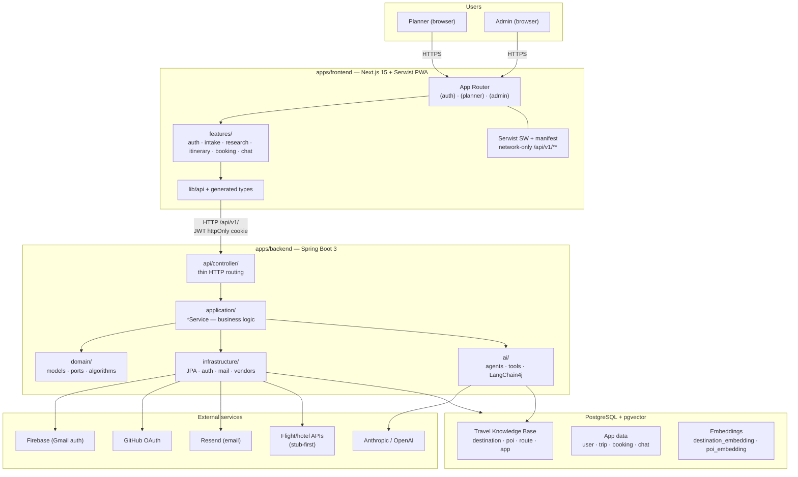

### 1.2 Backend hexagonal layers

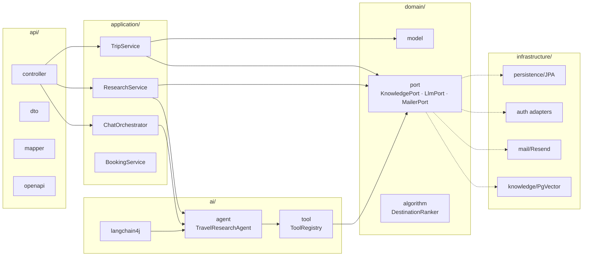

### 1.3 Data domains

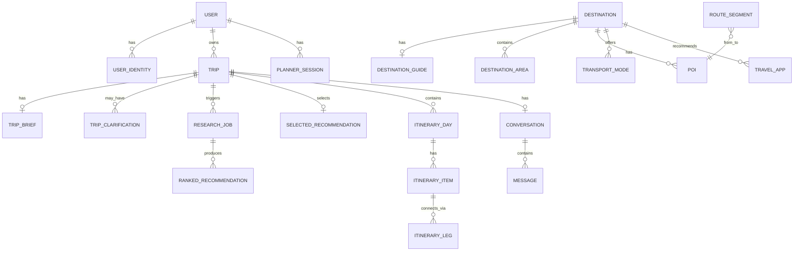

---

## 2. Flow diagrams

### 2.1 MVP end-to-end user flow

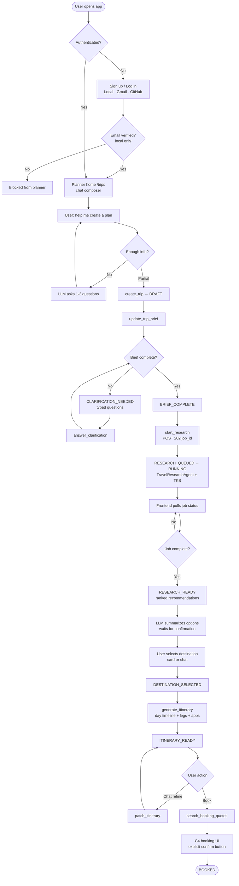

### 2.2 Chat tool orchestration flow

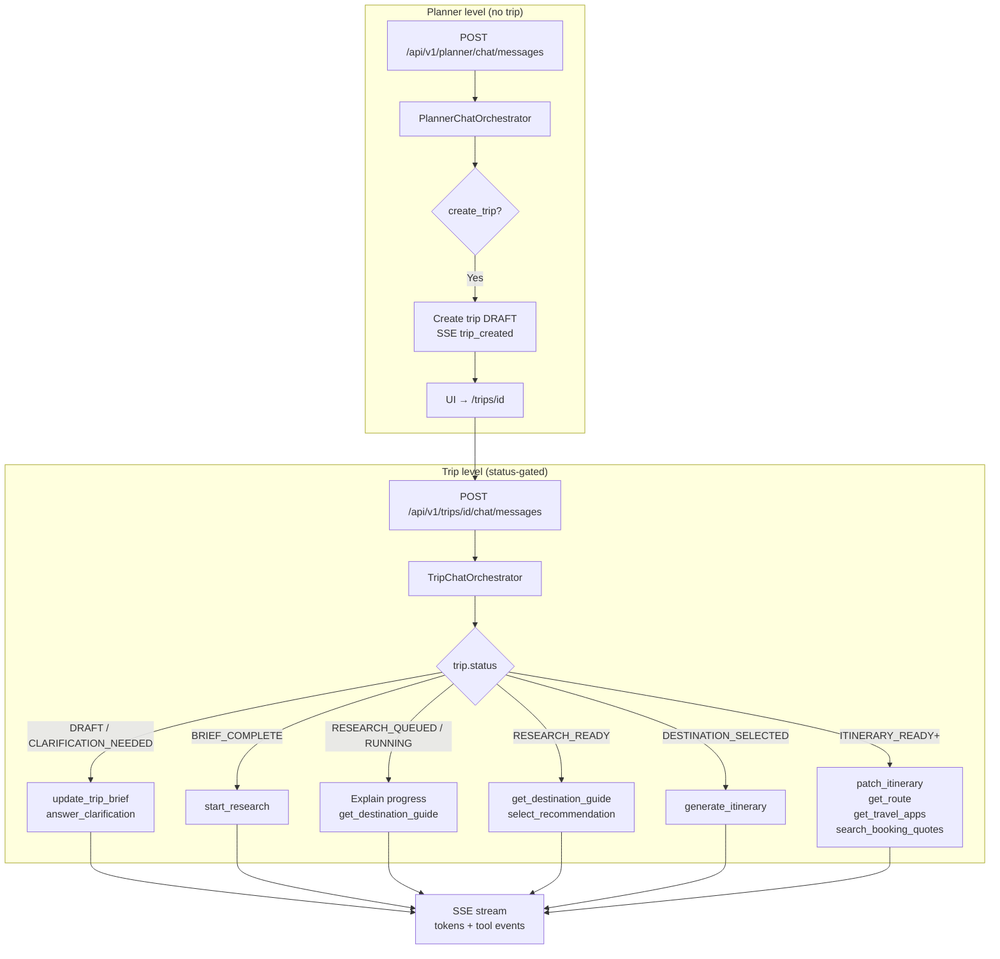

### 2.3 Knowledge-based AI flow (Retrieve → Reason → Ground)

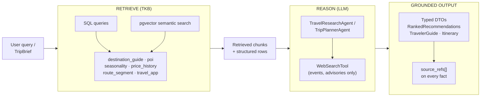

### 2.4 Booking state machine (C4)

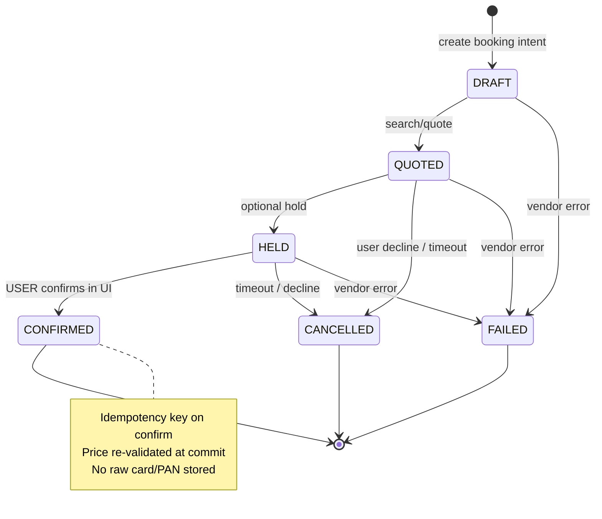

### 2.5 Authentication flow

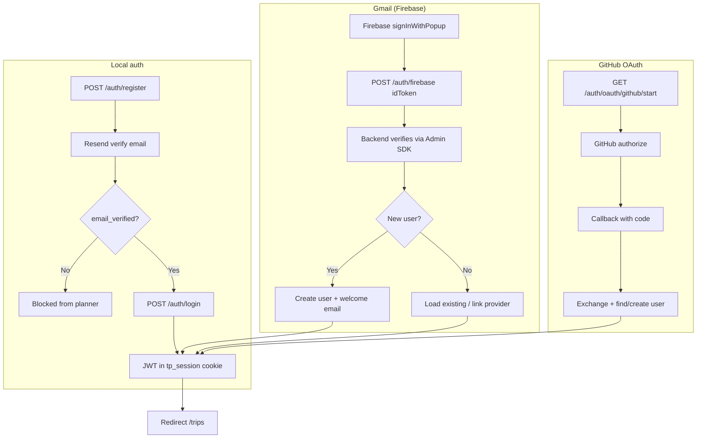

---

## 3. Activity diagrams

### 3.1 C1 — Intake & clarification

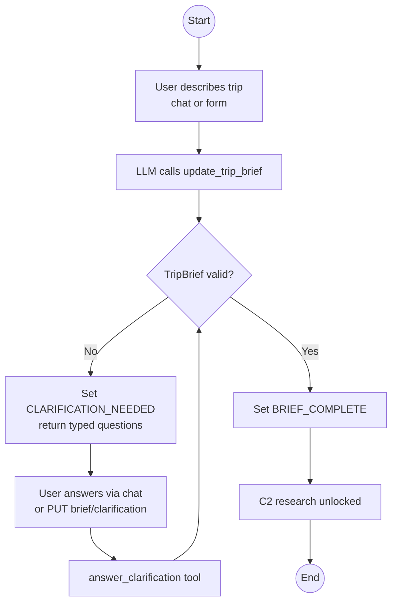

### 3.2 C2 — Async research job

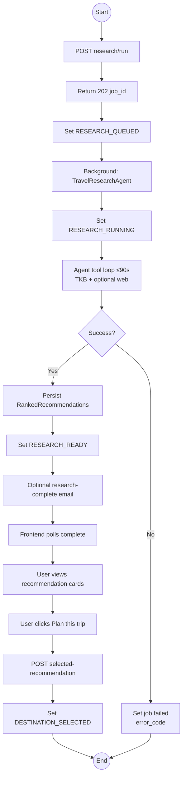

### 3.3 C3 — Itinerary generation

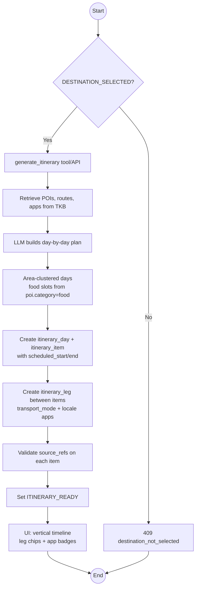

### 3.4 C5 — Chat turn processing (SSE)

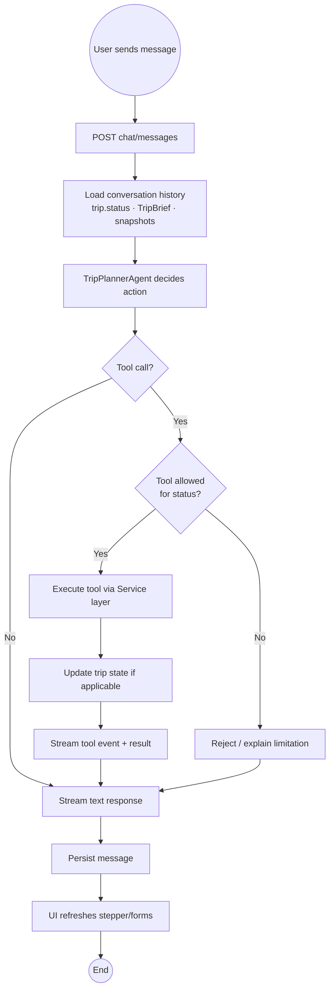

### 3.5 Full planning lifecycle (swimlanes)

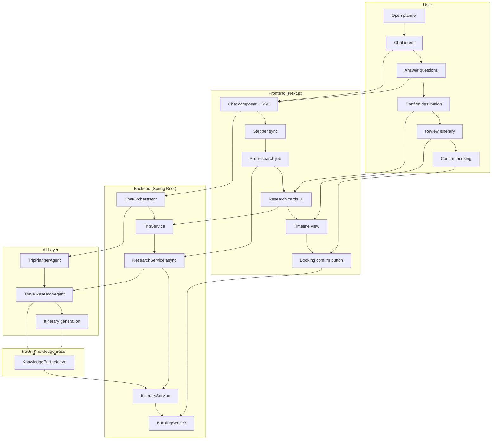

---

## 4. Component map (frontend ↔ backend ↔ features)

| Feature | Frontend module | Backend service | AI agent/tools | Status gate |
|---|---|---|---|---|
| C1 Intake | `features/intake/` | `TripBriefService` | `update_trip_brief`, `answer_clarification` | `DRAFT`, `CLARIFICATION_NEEDED` |
| C2 Research | `features/research/` | `ResearchService` | `TravelResearchAgent`, `start_research` | `BRIEF_COMPLETE` → `RESEARCH_READY` |
| C3 Itinerary | `features/itinerary/` | `ItineraryService` | `generate_itinerary`, `patch_itinerary` | `DESTINATION_SELECTED` → `ITINERARY_READY` |
| C4 Booking | `features/booking/` | `BookingService` | `search_booking_quotes` (propose only) | `ITINERARY_READY`+ |
| C5 Chat | `features/chat/` | `ChatOrchestrator` | `TripPlannerAgent`, all status-gated tools | All statuses |

---

## 5. Related documents

| Document | Content |
|---|---|
| [`plans/superpower/PLAN.md`](../plans/superpower/PLAN.md) | Master architecture, rules, NFRs |
| [`plans/USE-CASES.md`](../plans/USE-CASES.md) | Use case catalog, acceptance criteria |
| [`plans/TRAVEL-KNOWLEDGE-CATALOG.md`](../plans/TRAVEL-KNOWLEDGE-CATALOG.md) | TKB entity catalog |
| [`docs/UI-UX-DESIGN-SYSTEM.md`](UI-UX-DESIGN-SYSTEM.md) | Visual tokens, PWA presentation |
| [`docs/PLAN-COMPATIBILITY.md`](PLAN-COMPATIBILITY.md) | Post-merge plan compatibility review |
| [`docs/adr/`](adr/) | ADRs — Gradle, JWT, extensibility, auth, **PWA** |
